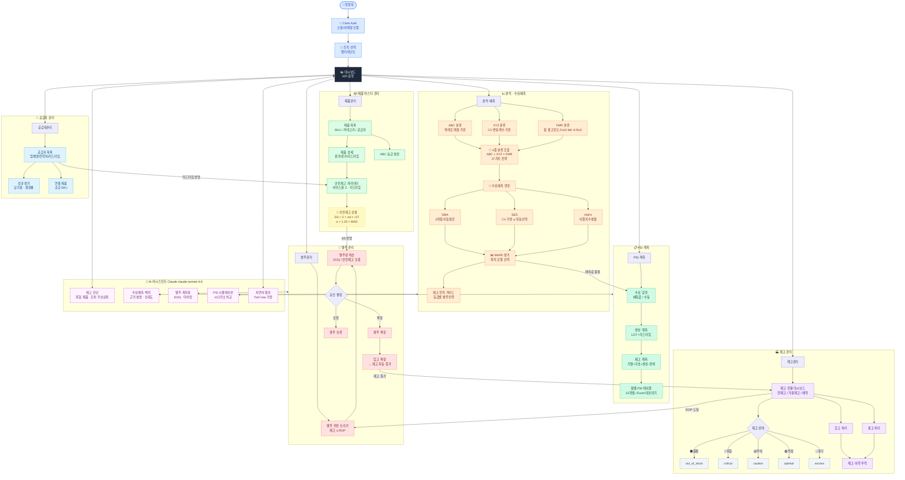

# Flostok 시스템 플로우차트

## Figma에서 열기

### 방법 1: SVG 직접 임포트 (권장)
1. Figma 열기 → File > Place Image
2. `flostok-flowchart.svg` 선택
3. 캔버스에 배치 → 더블클릭하면 벡터 편집 가능

### 방법 2: FigJam에서 Mermaid 사용
1. FigJam 열기
2. 좌측 툴바 → Shape → Mermaid 선택 (또는 `/mermaid` 입력)
3. 아래 코드 붙여넣기

### 방법 3: Figma 플러그인
- **"Diagram"** 플러그인: Mermaid 코드 임포트 가능
- **"Autoflow"** 플러그인: 플로우 연결 자동화

---

## Mermaid 코드

---

## 핵심 알고리즘 요약

| 구분 | 공식/기준 | 비고 |
|------|-----------|------|
| **SMA** | F(t) = (D(t-1)+D(t-2)+D(t-3)) / 3 | 3개월 슬라이딩 이동평균 |
| **SES** | F(t+1) = α×D(t) + (1-α)×F(t) | CV 기반 α 자동선택 |
| **Holt's** | Level + Trend 이중 지수평활 | 추세 데이터에 적합 |
| **표준편차** | σ = 1.25 × MAD | 이상치 강건 추정 |
| **안전재고** | SS = Z × σd × √LT | 방식 1/2/3 자동 선택 |
| **CV→α** | X(CV<0.2)→0.6, Y→0.4, Z(CV>0.5)→0.2 | 변동성 클수록 α 작게 |
| **FMR** | F≥10회/월, M=4~9회, R≤3회 | 월 출고빈도 기준 |
| **3중분류** | ABC × XYZ × FMR = 27가지 | 전략 매트릭스 |
